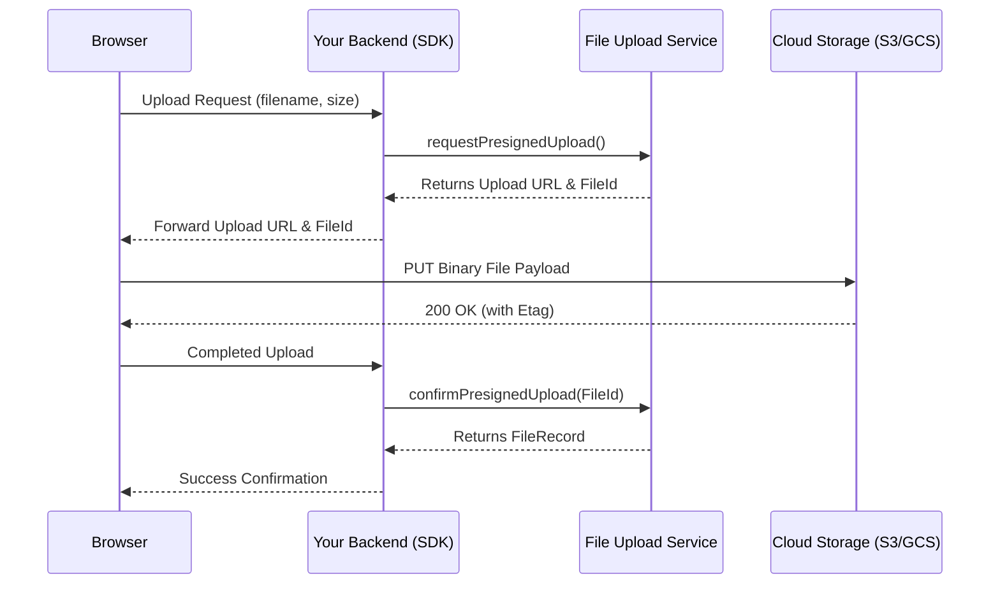

# File Upload Service SDK

An enterprise-grade, zero-dependency Node.js SDK for the multi-tenant **File Upload Service**. This SDK is designed for server-to-server integration, providing clean TypeScript interfaces, automated security (HMAC) signature generation, and out-of-the-box environment variable binding so you don't have to manually manage HTTP requests.

---

## Features

- **Zero Runtime Dependencies**: Uses Node 20+ native `fetch` and `FormData` globally.
- **Automated HMAC Signing**: Automatically signs user payload context headers when `gatewaySecret` is configured, preventing tampering.
- **Flexible Stream & Buffer Inputs**: Supports local paths, raw Buffers, NodeJS ReadableStreams, and standard Web Blobs/Files.
- **Context Preservation via `.asUser()`**: Clones the client with specific user headers to simplify server-to-server request forwarding.
- **100% Type-Safe**: Bundled with comprehensive TypeScript types.
- **Extended Operations**: Supports multipart cloud uploads, bulk operations, and audit trails.

---

## Installation

Install the package:

```bash
npm install file-upload-sdk
```

Or reference it locally in your workspace:

```json
"dependencies": {
  "file-upload-sdk": "file:../file-upload-service/sdk"
}
```

---

## Getting Started

### 1. Configure Environment Variables

The SDK automatically detects and binds to a group of environment variables. You can find a template configuration in the **[.env.example](file:///C:/Users/kisho/WorkSpace/Backend/file-upload-service/sdk/.env.example)** file. 

> [!NOTE]
> The SDK executes within your application process and reads directly from your service's `process.env`. There is no need to maintain a separate environment file for the SDK itself. Simply copy these variables directly into your server's existing `.env` configuration file:

```bash
# File Upload Service SDK Environment Configurations
FILE_SERVICE_URL=http://localhost:4001
FILE_SERVICE_HMAC_SECRET=your_gateway_hmac_secret_key
FILE_SERVICE_TENANT_ID=easydev
FILE_SERVICE_USER_ID=anonymous
FILE_SERVICE_USER_ROLE=anonymous
FILE_SERVICE_USER_EMAIL=
FILE_SERVICE_USER_NAME=
```

### 2. Initialize the Client

```typescript
import { FileUploadClient } from 'file-upload-sdk';

// Automatically uses environment variables for configuration:
const client = new FileUploadClient();

// Or configure explicitly:
const clientWithConfig = new FileUploadClient({
  baseUrl: 'https://files.mycompany.com',
  tenantId: 'my-tenant',
  gatewaySecret: 'my-super-secret-hmac-key', // Enables automatic X-Gateway-HMAC generation
  userId: 'server-process-1',
  userRole: 'admin'
});
```

---

## Core Operations

### Context Forwarding via `.asUser()`

If your server receives a request from a specific user, you can clone the client to act on behalf of that user. All subsequent calls made with the cloned client will use their identity headers (and recompute the HMAC signature accordingly):

```typescript
app.post('/my-api/upload', async (req, res) => {
  // Extract user context from incoming request
  const userContext = {
    userId: req.user.id,
    userRole: req.user.role,
    userEmail: req.user.email,
    userName: req.user.name,
    tenantId: req.tenantId // Multi-tenancy support
  };

  // Clone client for this specific request
  const userClient = client.asUser(userContext);

  const uploadResult = await userClient.uploadFiles([
    { file: req.file.buffer, filename: req.file.originalname, contentType: req.file.mimetype }
  ]);

  res.json(uploadResult);
});
```

---

## API Reference (Payloads & Responses)

All API responses follow a unified envelope format:
```typescript
interface ApiResponse<T> {
  success: boolean;
  statusCode: number;
  message?: string;
  data: T;
  timestamp: string;
  requestId: string;
}
```

---

### 1. General & Health

#### Check Service Health (`GET /health`)
```typescript
const health = await client.getHealth();
```
- **Response Shape (`HealthResponse`):**
  ```json
  {
    "status": "ok",
    "service": "file-upload-service",
    "version": "1.0.0",
    "timestamp": "2026-07-07T16:50:00.000Z",
    "uptime": 3600,
    "db": "connected",
    "memory": {
      "heapUsedMB": 45,
      "heapTotalMB": 72,
      "rssMB": 95
    }
  }
  ```

---

### 2. Private Route Operations (Requires `requireAuth`)

#### Upload Files (`POST /api/files/upload`)
- **SDK Method Call:**
  ```typescript
  const response = await client.uploadFiles(
    // Parameter 1: Array of file inputs (supports paths, streams, buffers, blobs)
    [
      { file: './invoices/january.pdf', contentType: 'application/pdf' },
      { file: Buffer.from('hello world'), filename: 'greeting.txt', contentType: 'text/plain' }
    ],
    // Parameter 2: Upload metadata properties (optional)
    {
      category: 'invoices',
      description: 'January billing doc',
      tags: ['billing', 'q1'],
      isPublic: false,
      custom: { invoiceId: 'inv_1092' }
    }
  );
  ```
- **Response Shape (`ApiResponse<UploadedFileSummary[]>`):**
  ```json
  {
    "success": true,
    "statusCode": 201,
    "message": "Files uploaded successfully",
    "data": [
      {
        "id": "6650a1234b5678c9d0e1f234",
        "originalName": "january.pdf",
        "size": 154200,
        "mimeType": "application/pdf",
        "category": "invoices",
        "url": "/uploads/files/my-tenant/user-123/1741234567890-uuid-january.pdf",
        "metadata": {
          "description": "January billing doc",
          "title": "",
          "altText": "",
          "author": "",
          "source": "",
          "language": "en",
          "expiresAt": null,
          "isPublic": false,
          "tags": ["billing", "q1"],
          "custom": { "invoiceId": "inv_1092" },
          "linkedTo": {}
        }
      }
    ],
    "timestamp": "2026-07-07T16:50:02.120Z",
    "requestId": "c9a8d435-0d2a-4a25-9f5b-118e38d976cf"
  }
  ```

---

#### List Files (`GET /api/files`)
- **SDK Method Call:**
  ```typescript
  const response = await client.listFiles({
    page: 1,
    limit: 10,
    sort: '-createdAt', // Prefix "-" for descending. Options: size, originalName, createdAt, updatedAt
    search: 'billing',  // Matches description and filename
    category: 'invoices',
    tags: ['billing'],
    isPublic: false
  });
  ```
- **Response Shape (`ApiResponse<ListFilesData>`):**
  ```json
  {
    "success": true,
    "statusCode": 200,
    "data": {
      "files": [
        {
          "id": "6650a1234b5678c9d0e1f234",
          "tenantId": "my-tenant",
          "originalName": "january.pdf",
          "storageKey": "files/my-tenant/user-123/1741234567890-uuid-january.pdf",
          "size": 154200,
          "mimeType": "application/pdf",
          "extension": ".pdf",
          "uploader": "user-123",
          "publicUrl": "/uploads/files/my-tenant/user-123/1741234567890-uuid-january.pdf",
          "category": "invoices",
          "metadata": {
            "description": "January billing doc",
            "title": "January Invoice Document",
            "altText": "",
            "author": "System Generator",
            "source": "",
            "language": "en",
            "expiresAt": null,
            "isPublic": false,
            "tags": ["billing"],
            "custom": { "invoiceId": "inv_1092" },
            "linkedTo": { "entityType": "customer", "entityId": "cust_394" }
          },
          "versions": [],
          "status": "active",
          "createdAt": "2026-03-06T10:00:00.000Z",
          "updatedAt": "2026-03-06T10:05:00.000Z"
        }
      ],
      "pagination": {
        "page": 1,
        "limit": 10,
        "total": 1,
        "pages": 1
      }
    },
    "timestamp": "2026-07-07T16:50:03.010Z",
    "requestId": "b3e0c7a4-8b9f-43d2-a7d5-d010cfa82792"
  }
  ```

---

#### Get File Metadata (`GET /api/files/:id`)
- **SDK Method Call:**
  ```typescript
  const response = await client.getFileMetadata('6650a1234b5678c9d0e1f234');
  ```
- **Response Shape (`ApiResponse<FileRecord>`):**
  Same single `FileRecord` structure as shown in the `files` array inside `listFiles` data.

---

#### Download File (`GET /api/files/:id/download`)
- **SDK Method Call (Gets stream Response):**
  ```typescript
  // Downloads binary stream
  const response = await client.downloadFile('6650a1234b5678c9d0e1f234', { inline: false });
  // Or direct redirect URL for cloud storage providers:
  const signedUrlResponse = await client.downloadFile('6650a1234b5678c9d0e1f234', { signed: true });
  ```

---

#### Rename File (`PATCH /api/files/:id/rename`)
- **SDK Method Call:**
  ```typescript
  const response = await client.renameFile('6650a1234b5678c9d0e1f234', 'january_final.pdf');
  ```
- **Response Shape (`ApiResponse<{ file: FileRecord }>`):**
  ```json
  {
    "success": true,
    "statusCode": 200,
    "message": "File renamed successfully",
    "data": {
      "file": {
        "id": "6650a1234b5678c9d0e1f234",
        "originalName": "january_final.pdf",
        "storageKey": "files/my-tenant/user-123/1741234567890-uuid-january.pdf",
        "size": 154200,
        "mimeType": "application/pdf",
        "extension": ".pdf",
        "uploader": "user-123",
        "metadata": { ... },
        "status": "active",
        "createdAt": "2026-03-06T10:00:00.000Z",
        "updatedAt": "2026-07-07T16:50:04.000Z"
      }
    },
    "timestamp": "2026-07-07T16:50:04.100Z",
    "requestId": "e9a2d8e3-0d2a-4a25-9f5b-118e38d976cc"
  }
  ```

---

#### Update File Metadata (`PATCH /api/files/:id`)
- **SDK Method Call:**
  ```typescript
  const response = await client.updateFileMetadata('6650a1234b5678c9d0e1f234', {
    originalName: 'newName.pdf',
    category: 'invoices',
    metadata: {
      description: 'January billing document - verified',
      tags: ['billing', 'verified'],
      custom: { billingId: 'bill_981', verified: true },
      linkedTo: { entityType: 'customer', entityId: 'cust_394' }
    }
  });
  ```
- **Response Shape (`ApiResponse<{ file: FileRecord }>`):**
  Same structure as the rename endpoint returning `{ file: FileRecord }` with updated values.

---

#### Replace File Content (`PUT /api/files/:id/replace`)
Replaces binary data. Previous version is moved to `versions: [...]` history array.
- **SDK Method Call:**
  ```typescript
  const response = await client.replaceFile('6650a1234b5678c9d0e1f234', {
    file: './invoices/january_revised.pdf',
    contentType: 'application/pdf'
  });
  ```
- **Response Shape (`ApiResponse<{ file: FileRecord }>`):**
  ```json
  {
    "success": true,
    "statusCode": 200,
    "data": {
      "file": {
        "id": "6650a1234b5678c9d0e1f234",
        "originalName": "january.pdf",
        "storageKey": "files/my-tenant/user-123/1741234567895-uuid-january_revised.pdf",
        "size": 156100,
        "mimeType": "application/pdf",
        "extension": ".pdf",
        "uploader": "user-123",
        "metadata": { ... },
        "versions": [
          {
            "versionNumber": 1,
            "storageKey": "files/my-tenant/user-123/1741234567890-uuid-january.pdf",
            "size": 154200,
            "uploadedBy": "user-123",
            "createdAt": "2026-03-06T10:00:00.000Z"
          }
        ],
        "status": "active",
        "createdAt": "2026-03-06T10:00:00.000Z",
        "updatedAt": "2026-07-07T16:50:06.000Z"
      }
    },
    "timestamp": "2026-07-07T16:50:06.120Z",
    "requestId": "a5e0b7c4-8b9f-43d2-a7d5-d010cfa82792"
  }
  ```

---

#### Soft Delete File (`DELETE /api/files/:id`)
- **SDK Method Call:**
  ```typescript
  const response = await client.deleteFile('6650a1234b5678c9d0e1f234');
  ```
- **Response Shape (`ApiResponse<{ file: FileRecord }>`):**
  ```json
  {
    "success": true,
    "statusCode": 200,
    "data": {
      "file": {
        "id": "6650a1234b5678c9d0e1f234",
        "originalName": "january.pdf",
        "status": "deleted",
        "createdAt": "2026-03-06T10:00:00.000Z",
        "updatedAt": "2026-07-07T16:50:07.000Z"
        // ...other unchanged fields
      }
    },
    "timestamp": "2026-07-07T16:50:07.100Z",
    "requestId": "d8e3b3e0-0d2a-4a25-9f5b-118e38d976cc"
  }
  ```

---

### 3. Admin Operations (Requires `requireAdmin` + HMAC setup)

#### Permanent Delete File (`DELETE /api/files/:id/permanent`)
- **SDK Method Call:**
  ```typescript
  const response = await client.permanentDeleteFile('6650a1234b5678c9d0e1f234');
  ```
- **Response Shape (`ApiResponse<void>`):**
  ```json
  {
    "success": true,
    "statusCode": 200,
    "message": "File permanently deleted",
    "data": null,
    "timestamp": "2026-07-07T16:50:08.000Z",
    "requestId": "f8a7e0f2-b883-4a18-9bfd-3897d2645831"
  }
  ```

---

#### Bulk Delete (`POST /api/files/bulk/delete` or `permanent-delete`)
- **SDK Method Call:**
  ```typescript
  // Soft delete multiple:
  await client.bulkDelete(['id_1', 'id_2'], { permanent: false });
  // Permanent delete multiple:
  await client.bulkDelete(['id_1', 'id_2'], { permanent: true });
  ```
- **Response Shape (`ApiResponse<void>`):**
  ```json
  {
    "success": true,
    "statusCode": 200,
    "message": "Bulk delete completed successfully",
    "data": null,
    "timestamp": "2026-07-07T16:50:09.000Z",
    "requestId": "c9a8d435"
  }
  ```

---

#### Bulk Update Metadata (`PATCH /api/files/bulk/metadata`)
- **SDK Method Call:**
  ```typescript
  const response = await client.bulkUpdateMetadata(['id_1', 'id_2'], {
    category: 'archived-invoices',
    metadata: {
      expiresAt: '2028-12-31T23:59:59.000Z'
    }
  });
  ```
- **Response Shape (`ApiResponse<void>`):**
  ```json
  {
    "success": true,
    "statusCode": 200,
    "message": "Bulk metadata update completed successfully",
    "data": null,
    "timestamp": "2026-07-07T16:50:10.000Z",
    "requestId": "b3e0c7a4"
  }
  ```

---

#### Bulk Get Signed URLs (`POST /api/files/bulk/signed-urls`)
- **SDK Method Call:**
  ```typescript
  const response = await client.bulkGetSignedUrls(['id_1', 'id_2'], 3600); // 1 hour expiry
  ```
- **Response Shape (`ApiResponse<Record<string, string>>`):**
  ```json
  {
    "success": true,
    "statusCode": 200,
    "data": {
      "id_1": "https://s3.amazonaws.com/my-bucket/files/my-tenant/user-123/1741-id_1.jpg?Signature=...",
      "id_2": "https://s3.amazonaws.com/my-bucket/files/my-tenant/user-123/1742-id_2.pdf?Signature=..."
    },
    "timestamp": "2026-07-07T16:50:11.000Z",
    "requestId": "a5e0b7c4"
  }
  ```

---

#### Get File Audit Transactions (`GET /api/files/:id/transactions`)
- **SDK Method Call:**
  ```typescript
  const response = await client.getFileTransactions('6650a1234b5678c9d0e1f234');
  ```
- **Response Shape (`ApiResponse<TransactionRecord[]>`):**
  ```json
  {
    "success": true,
    "statusCode": 200,
    "data": [
      {
        "id": "6650a1234b5678c9d0e1f23a",
        "tenantId": "my-tenant",
        "fileId": "6650a1234b5678c9d0e1f234",
        "operation": "replace",
        "status": "success",
        "performedBy": "user-123",
        "requestId": "f8a7e0f2-b883-4a18-9bfd-3897d2645831",
        "payload": {
          "originalName": "january_revised.pdf",
          "size": 156100
        },
        "providerResponse": {
          "etag": "ab83fd97e3..."
        },
        "createdAt": "2026-07-07T16:50:06.000Z",
        "updatedAt": "2026-07-07T16:50:06.000Z"
      },
      {
        "id": "6650a1234b5678c9d0e1f237",
        "tenantId": "my-tenant",
        "fileId": "6650a1234b5678c9d0e1f234",
        "operation": "upload",
        "status": "success",
        "performedBy": "user-123",
        "requestId": "b3e0c7a4-8b9f-43d2-a7d5-d010cfa82792",
        "payload": {
          "originalName": "january.pdf",
          "size": 154200
        },
        "createdAt": "2026-03-06T10:00:00.000Z",
        "updatedAt": "2026-03-06T10:00:00.000Z"
      }
    ],
    "timestamp": "2026-07-07T16:50:12.000Z",
    "requestId": "d8e3b3e0"
  }
  ```

---

### 4. Direct Cloud Presigned Uploads (Avoids proxying payload through your server)



#### Step 1: Request Presigned URL (`POST /api/files/upload/presign`)
- **SDK Method Call:**
  ```typescript
  const response = await client.requestPresignedUpload({
    filename: 'movie.mp4',
    contentType: 'video/mp4',
    size: 250000000,
    expiresIn: 3600, // 1 hour
    category: 'videos'
  });
  ```
- **Response Shape (`ApiResponse<PresignedUploadResponse>`):**
  ```json
  {
    "success": true,
    "statusCode": 200,
    "data": {
      "fileId": "6650a1234b5678c9d0e1f234",
      "uploadUrl": "https://s3.amazonaws.com/my-bucket/files/my-tenant/user-123/1741-movie.mp4?AWSAccessKeyId=...&Signature=...",
      "expiresAt": "2026-07-07T17:50:13.000Z"
    },
    "timestamp": "2026-07-07T16:50:13.000Z",
    "requestId": "b3e0c7a4"
  }
  ```

#### Step 2: Confirm Upload Completion (`POST /api/files/upload/presign/:id/confirm`)
- **SDK Method Call:**
  ```typescript
  const response = await client.confirmPresignedUpload('6650a1234b5678c9d0e1f234');
  ```
- **Response Shape (`ApiResponse<FileRecord>`):**
  Returns the complete active `FileRecord` structure.

---

### 5. Multipart Cloud Uploads (Recommended for S3/R2 files > 100 MB)

#### Step 1: Initiate Multipart Session (`POST /api/files/upload/multipart/initiate`)
- **SDK Method Call:**
  ```typescript
  const response = await client.initiateMultipartUpload({
    filename: 'archive.zip',
    contentType: 'application/zip',
    size: 1073741824, // 1 GB
    category: 'archives'
  });
  ```
- **Response Shape (`ApiResponse<MultipartInitiateResponse>`):**
  ```json
  {
    "success": true,
    "statusCode": 200,
    "data": {
      "fileId": "6650a1234b5678c9d0e1f234",
      "uploadId": "mp-upload-session-xyz123"
    },
    "timestamp": "2026-07-07T16:50:14.000Z",
    "requestId": "a5e0b7c4"
  }
  ```

#### Step 2: Request Part URLs (`POST /api/files/upload/multipart/:id/parts`)
- **SDK Method Call:**
  ```typescript
  const response = await client.getMultipartPartUrls(
    '6650a1234b5678c9d0e1f234', // fileId
    [1, 2, 3]                  // partNumbers
  );
  ```
- **Response Shape (`ApiResponse<MultipartPartUrlsResponse>`):**
  ```json
  {
    "success": true,
    "statusCode": 200,
    "data": {
      "fileId": "6650a1234b5678c9d0e1f234",
      "uploadId": "mp-upload-session-xyz123",
      "parts": [
        { "partNumber": 1, "uploadUrl": "https://s3.amazonaws.com/...partNumber=1..." },
        { "partNumber": 2, "uploadUrl": "https://s3.amazonaws.com/...partNumber=2..." },
        { "partNumber": 3, "uploadUrl": "https://s3.amazonaws.com/...partNumber=3..." }
      ]
    },
    "timestamp": "2026-07-07T16:50:15.000Z",
    "requestId": "d8e3b3e0"
  }
  ```

#### Step 3: Complete Multipart Upload (`POST /api/files/upload/multipart/:id/complete`)
- **SDK Method Call:**
  ```typescript
  const response = await client.completeMultipartUpload(
    '6650a1234b5678c9d0e1f234',
    [
      { partNumber: 1, etag: '"etag-for-part-1"' },
      { partNumber: 2, etag: '"etag-for-part-2"' },
      { partNumber: 3, etag: '"etag-for-part-3"' }
    ]
  );
  ```
- **Response Shape (`ApiResponse<FileRecord>`):**
  Returns the complete active `FileRecord` structure.

#### Optional: Abort Multipart Session (`DELETE /api/files/upload/multipart/:id/abort`)
- **SDK Method Call:**
  ```typescript
  await client.abortMultipartUpload('6650a1234b5678c9d0e1f234');
  ```

---

## Error Handling

Errors from the API are parsed and thrown as `FileUploadError` objects containing status codes and specific API error fields:

```typescript
import { FileUploadError } from 'file-upload-sdk';

try {
  await client.uploadFiles([{ file: './malicious.exe', contentType: 'application/x-msdownload' }]);
} catch (error) {
  if (error instanceof FileUploadError) {
    console.error(`Status: ${error.statusCode}`); // e.g. 400
    console.error(`Code: ${error.errorCode}`);    // e.g. "VALIDATION_ERROR"
    console.error(`Errors:`, error.details);      // Joi error array
  } else {
    console.error('Network or other error:', error);
  }
}
```
